# Lab 01 – Invoke a REST API using webMethods Workflow

## Overview

In this lab, you will create a Workflow in IBM webMethods Integration that invokes a REST API using an HTTP GET request.

The Workflow will use a Webhook to trigger an HTTP Request and retrieve a JSON response from a REST API.

The final Workflow will look like:

Webhook → HTTP Request → Stop

## Prerequisites

Before starting this lab, you need:

- Access to IBM webMethods Integration
- Access to the Project Workspace
- Permission to create a project and Workflow

## REST API Used in This Lab

This lab uses the JSONPlaceholder REST API.

**Endpoint:**

https://jsonplaceholder.typicode.com/posts/1

**HTTP Method:**

GET

The API returns JSON data for a sample post.

## Step-by-Step Tutorial

### Step 1 – Create the Project

Log in to IBM Integration SaaS and open webMethods Integration.

You will land in the Project Workspace.

Click **New Project** and create the project:

`WebMethodsIntegrationLabs`

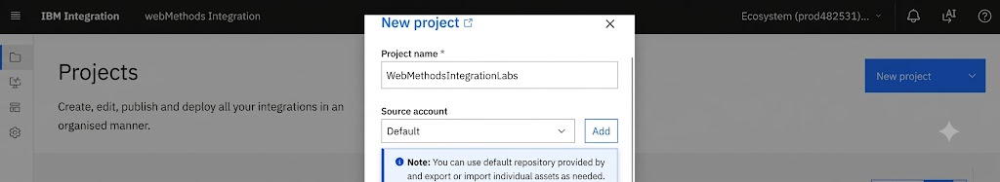

### Step 2 – Create the Workflow

Inside the project, select **Workflows**.

Click the **+** icon and select **Create New Workflow**.

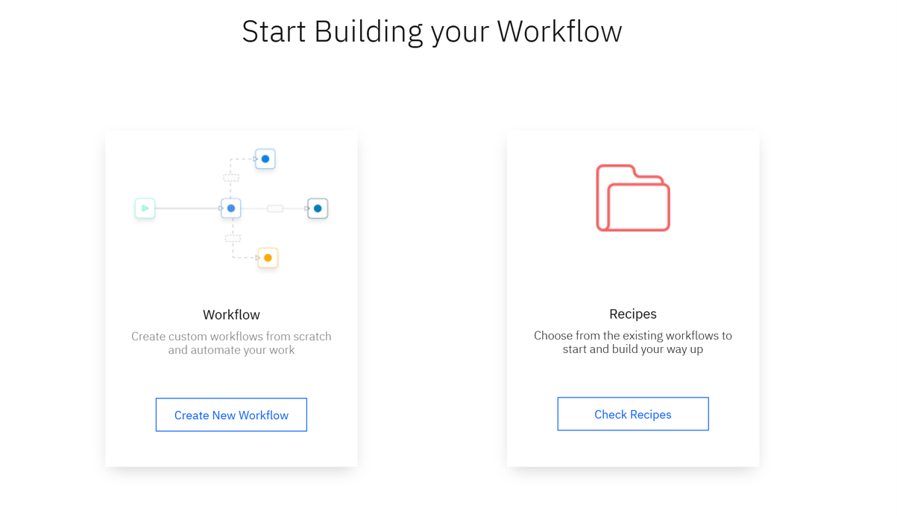

### Step 3 – Name the Workflow

Enter the Workflow name:

`REST_GET_Request`

Click **Confirm**.

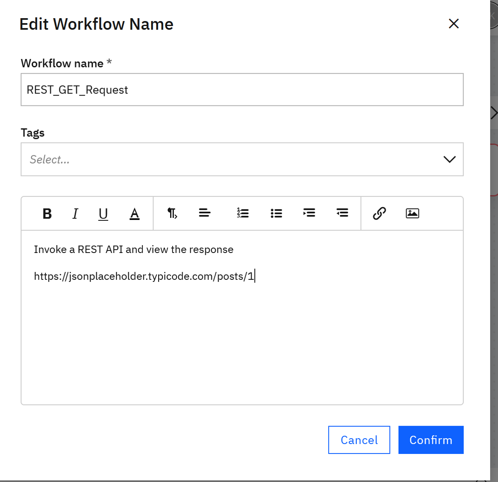

### Step 4 – Define the Trigger

Click **Define Trigger**.

Select **Webhook**.

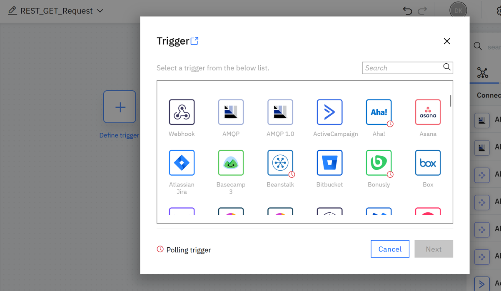

### Step 5 – Configure the Webhook

Configure the Webhook and proceed through the configuration by clicking **Next**.

Click **Done** when the configuration is complete.

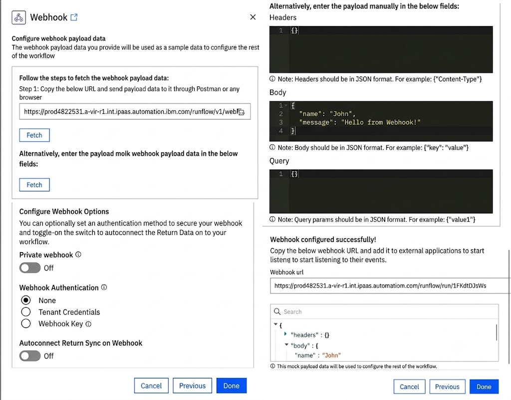

### Step 6 – Add the HTTP Request

Add an **HTTP Request** action after the Webhook.

The Workflow should look like:

Webhook → HTTP Request → Stop

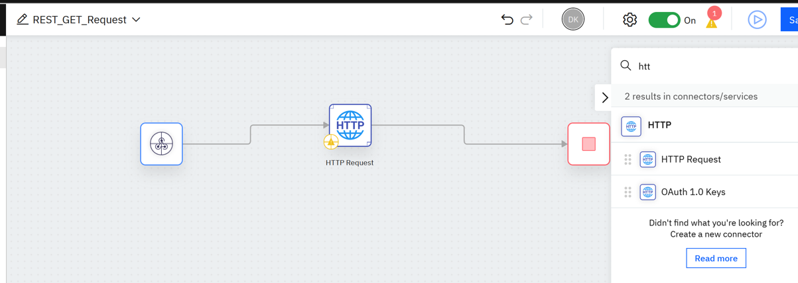

### Step 7 – Configure the HTTP Request

Open the HTTP Request configuration.

Set:

| Field | Value |
|---|---|
| Method | GET |
| URL | https://jsonplaceholder.typicode.com/posts/1 |

Click **Next**.

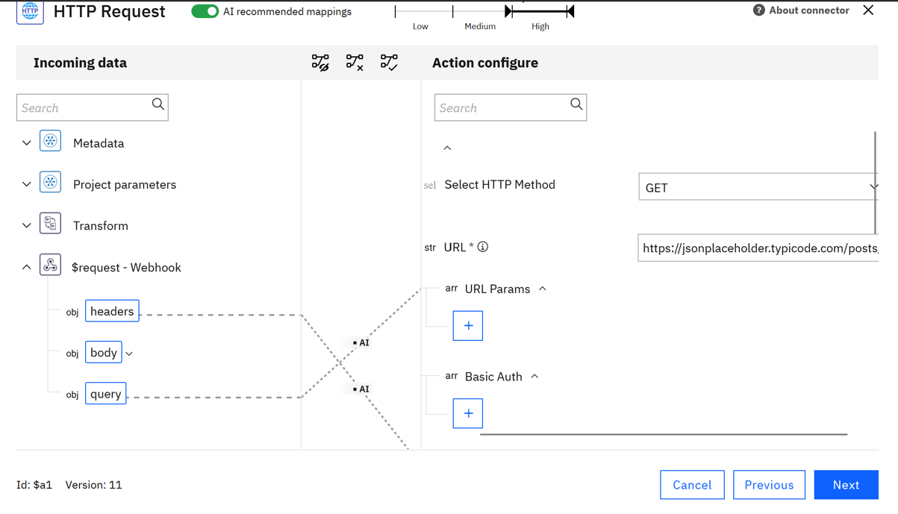

### Step 8 – Test the HTTP Request

Open the **Output** tab.

Click **Test**.

The API should return a JSON response containing fields such as:

- userId
- id
- title
- body

Click **Done** after reviewing the response.

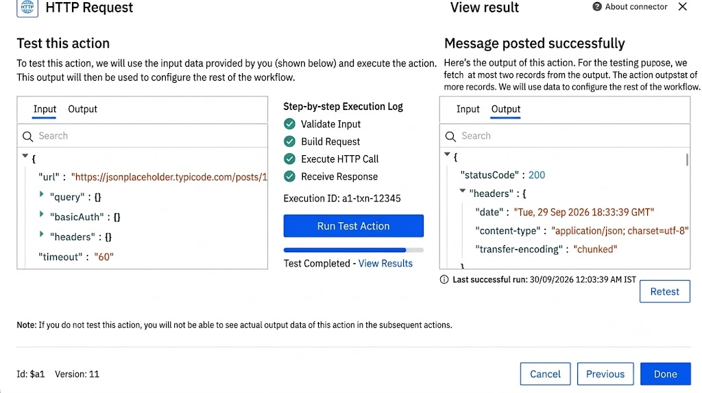

### Step 9 – Save the Workflow

Save the Workflow.

The completed Workflow should be:

Webhook → HTTP Request → Stop

### Step 10 – Run the Workflow

Use the **Run / Play** option to execute the Workflow.

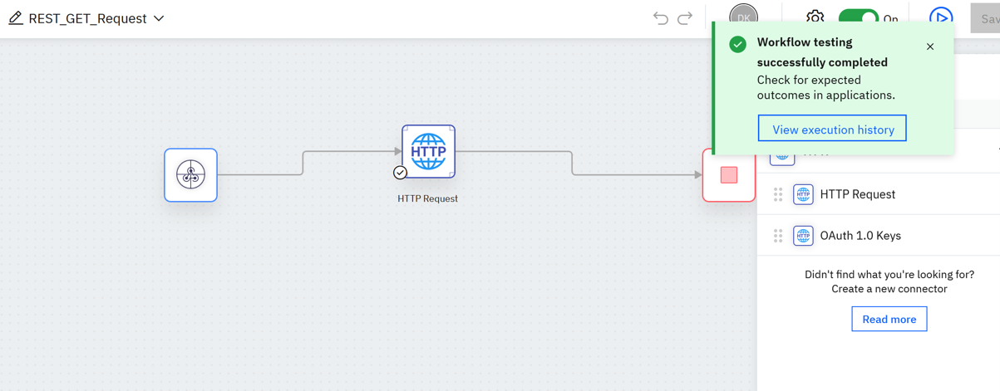

### Step 11 – View Execution History

Click **View Execution History**.

Open the latest execution.

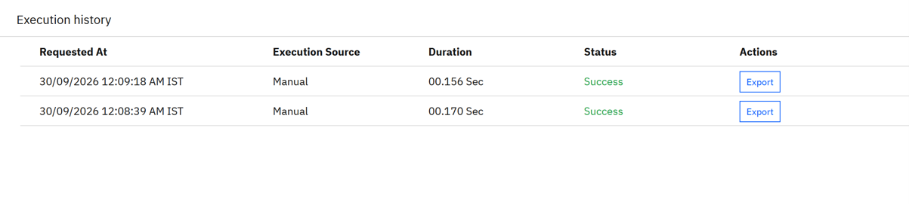

### Step 12 – Review the Execution Result

Review the execution details.

The HTTP Request should show the response returned by the REST API.

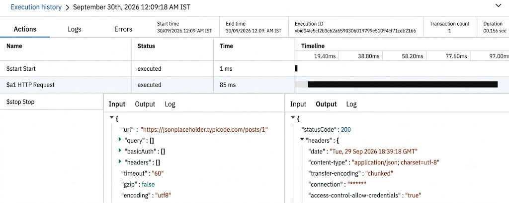

## Expected Result

The Workflow successfully calls the REST API using an HTTP GET request and receives the JSON response.

The final Workflow is:

Webhook → HTTP Request → Stop

## What You Learned

In this lab, you learned how to:

- Create a project in IBM webMethods Integration
- Create a Workflow
- Configure a Webhook trigger
- Add an HTTP Request
- Configure an HTTP GET request
- Test the REST API request
- Execute the Workflow
- View the execution history
- Review the API response

## Lab Complete

You have successfully created your first REST API integration using a webMethods Workflow.
