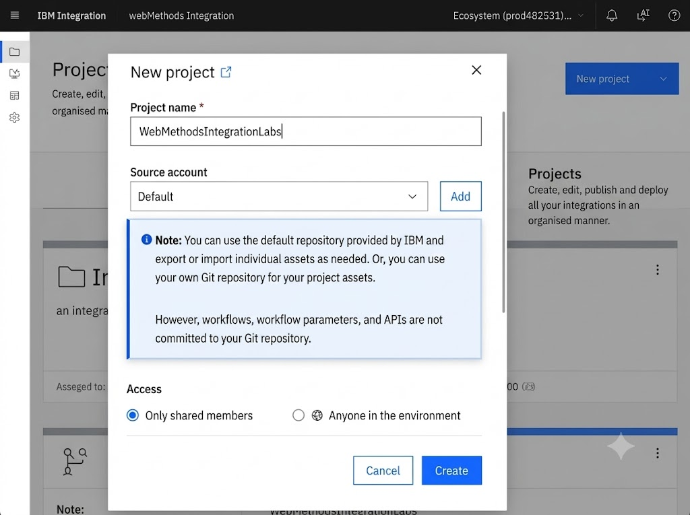
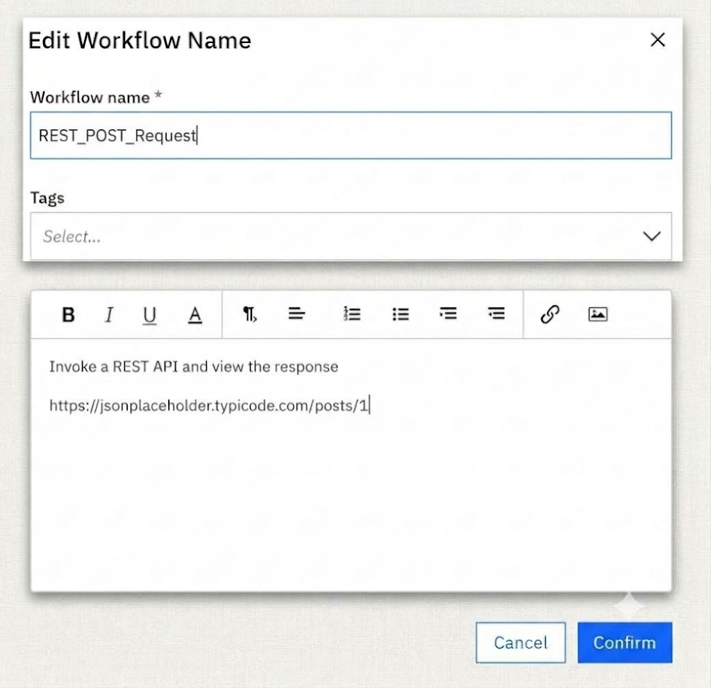

# Lab 02 - Invoke a REST API using HTTP POST

## 1. Lab Overview

In this lab, you will create a Workflow in IBM webMethods Integration that invokes a REST API using an HTTP POST request.

The Workflow will use a Webhook to trigger an HTTP Request and retrieve a JSON response from a REST API.

The final Workflow will look like:

Webhook → HTTP Request → Stop

## Prerequisites

Before starting this lab, you need:

- Access to IBM webMethods Integration
- Access to the Project Workspace
- Permission to create a project and Workflow

## REST API Used in This Lab

This lab uses the JSONPlaceholder REST API.

**Endpoint:**

https://jsonplaceholder.typicode.com/posts

**HTTP Method:**

POST 

## Step-by-Step Tutorial

 ### Step 1 – Create the Project

Log in to IBM Integration SaaS and open webMethods Integration.

You will land in the Project Workspace.

Click **New Project** and create the project:

`WebMethodsIntegrationLabs`

### Step 2 – Create the Workflow

Inside the project, select **Workflows**.

Click the **+** icon and select **Create New Workflow**.

### Step 3 – Name the Workflow

Enter the Workflow name:

`REST_POST_Request`

Click **Confirm**.

