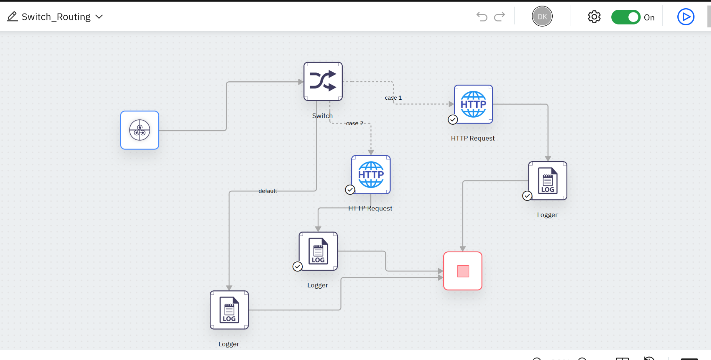
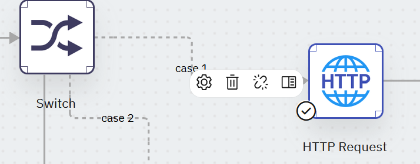
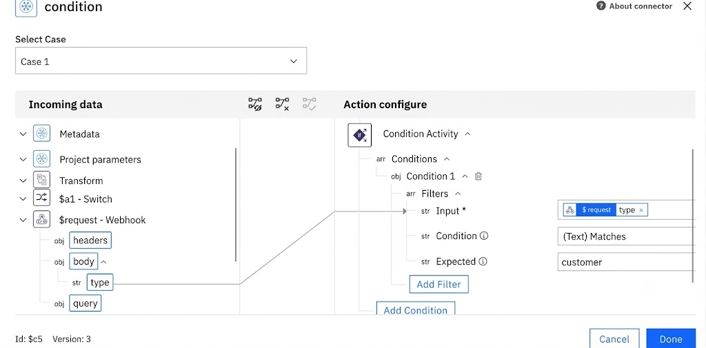
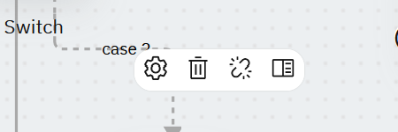
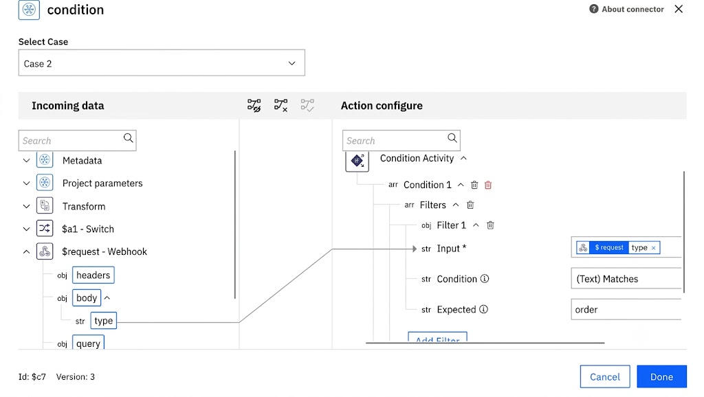
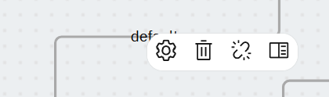
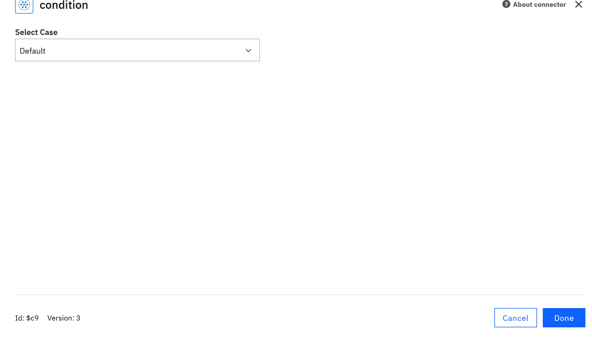
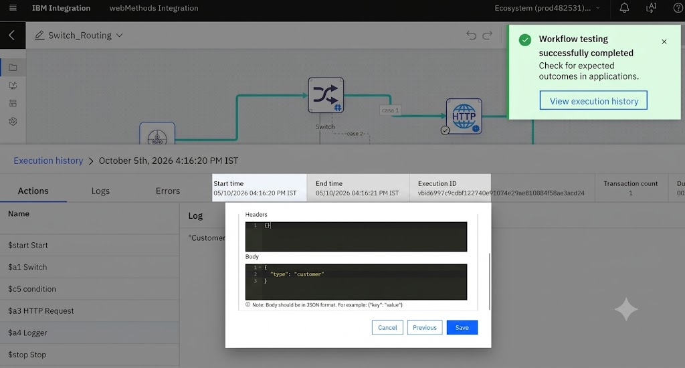

# Lab 03 – Route a Workflow using Switch

**IBM webMethods Integration | Hands-on Workflow Lab**

## 1. Lab Overview

In this lab, you build a webMethods Workflow that uses a **Switch** to route an incoming request based on the value of a field in the webhook payload.

The workflow checks `$request.type` and routes the request to one of three paths:

- `customer` → Case 1
- `order` → Case 2
- Any other value → Default

Each route performs its configured actions and then reaches the workflow **Stop** node.

---

## 2. What You Will Build

The completed workflow is:

```text
                         ┌─ Case 1 (customer) → HTTP Request → Logger ─┐
Webhook → Switch ────────┼─ Case 2 (order)    → HTTP Request → Logger ─┤→ Stop
                         └─ Default           → Logger ────────────────┘
```

### Final Workflow



The screenshot above shows the completed `Switch_Routing` workflow, including the **Stop** node.

---

## 3. Project and Workflow Details

| Item | Value |
|---|---|
| Project | `WebMethodsIntegrationLabs` |
| Workflow | `Switch_Routing` |
| Trigger | Webhook |
| Routing activity | Switch / Condition |
| Case 1 | `customer` |
| Case 2 | `order` |
| Default | Any other value |

---

## 4. Prerequisites

- Access to IBM webMethods Integration
- Access to the `WebMethodsIntegrationLabs` project
- Basic understanding of workflows and webhooks

---

# 5. Build the Workflow

## Step 1 – Create the Workflow

Open the `WebMethodsIntegrationLabs` project and create a new workflow named:

```text
Switch_Routing
```

Add a **Webhook** trigger as the workflow input.

The webhook request will contain a `type` field that the Switch will use for routing.

---

## Step 2 – Add the Switch

Add a **Switch** activity after the Webhook.

The Switch provides three routing paths:

| Path | Condition |
|---|---|
| Case 1 | `$request.type` matches `customer` |
| Case 2 | `$request.type` matches `order` |
| Default | All other values |

---

# 6. Configure Case 1 – Customer

## Step 6.1 – Open Case 1 Configuration

Hover over **Case 1** and select the **gear icon** to open the case configuration.



## Step 6.2 – Configure the Condition

Configure Case 1 as follows:

- **Input:** `$request` → `type`
- **Condition:** `(Text) Matches`
- **Expected:** `customer`



Click **Done** to save the Case 1 condition.

Case 1 should route requests where:

```text
$request.type = customer
```

---

# 7. Configure Case 2 – Order

## Step 7.1 – Open Case 2 Configuration

Hover over **Case 2** and select the **gear icon**.



## Step 7.2 – Configure the Condition

Configure Case 2 as follows:

- **Input:** `$request` → `type`
- **Condition:** `(Text) Matches`
- **Expected:** `order`



Click **Done** to save the Case 2 condition.

Case 2 should route requests where:

```text
$request.type = order
```

---

# 8. Configure the Default Case

The Default path is used when the incoming `type` does not match either Case 1 or Case 2.

## Step 8.1 – Open the Default Configuration

Hover over the **Default** path and select the **gear icon**.



## Step 8.2 – Confirm Default

The Default case does not require a matching condition. It acts as the fallback route.



Click **Done**.

For example, this request will use the Default path:

```json
{
  "type": "product"
}
```

---

# 9. Configure the Actions on Each Route

The completed workflow contains the following actions:

### Case 1 – Customer

```text
Case 1 → HTTP Request → Logger
```

Logger message:

```text
Customer request received
```

### Case 2 – Order

```text
Case 2 → HTTP Request → Logger
```

Logger message:

```text
Order request received
```

### Default

```text
Default → Logger
```

Logger message:

```text
Unknown request type
```

All paths lead to the workflow **Stop** node.

> The exact HTTP Request configuration is not reproduced here because this lab focuses on Switch-based routing. The important part of the lab is how the incoming `type` value determines the path taken through the workflow.

---

# 10. Final Workflow

After configuring the cases and actions, verify that the workflow looks like the following:


The final workflow contains:

- Webhook
- Switch
- Case 1 → HTTP Request → Logger
- Case 2 → HTTP Request → Logger
- Default → Logger
- Stop

---

# 11. Test the Workflow

Test the workflow with different values of the `type` field to verify that the Switch routes the request correctly.

| Test | Input | Expected route | Expected result |
|---|---|---|---|
| Customer | `customer` | Case 1 | `Customer request received` |
| Order | `order` | Case 2 | `Order request received` |
| Unknown | `product` | Default | `Unknown request type` |

---

## Test 1 – Customer

Send the following webhook payload:

```json
{
  "type": "customer"
}
```

The request should follow **Case 1**.

### Execution Result

The workflow test completed successfully with the customer payload. The execution history shows the request moving through the Switch, condition, HTTP Request, Logger, and Stop.



---

## Test 2 – Order

Send:

```json
{
  "type": "order"
}
```

Expected route:

```text
Webhook → Switch → Case 2 → HTTP Request → Logger → Stop
```

Expected logger message:

```text
Order request received
```

---

## Test 3 – Unknown Type

Send:

```json
{
  "type": "product"
}
```

Expected route:

```text
Webhook → Switch → Default → Logger → Stop
```

Expected logger message:

```text
Unknown request type
```

---

# 12. Expected Routing Behaviour

After testing all three payloads, the routing behaviour should be:

```text
                    ┌─ customer → Case 1 → HTTP Request → Logger
Webhook → Switch ───┼─ order    → Case 2 → HTTP Request → Logger
                    └─ other    → Default → Logger
                                             ↓
                                            Stop
```

This demonstrates how a Switch can route workflow execution based on incoming request data.

---

# 13. Troubleshooting

### The workflow takes the Default path unexpectedly

Check the incoming JSON and confirm that the `type` field contains the expected value.

For Case 1:

```json
{
  "type": "customer"
}
```

For Case 2:

```json
{
  "type": "order"
}
```

Also verify that the condition uses:

```text
$request → type
```

with:

```text
(Text) Matches
```

### The Default path is being used for `customer` or `order`

Reopen the relevant Case configuration and verify the **Expected** value:

- Case 1 → `customer`
- Case 2 → `order`

### The workflow does not complete

Check that the configured branches are connected correctly and that the final workflow contains the **Stop** node.

---

# 14. What You Learned

By completing this lab, you learned how to:

- Create a workflow with a Webhook trigger
- Add a Switch to a workflow
- Configure multiple Switch cases
- Use `$request.type` as the routing input
- Match text values such as `customer` and `order`
- Configure a Default/fallback route
- Route different requests to different workflow actions
- Test the workflow using different input payloads
- Review execution history and results

---

# 15. Enterprise Relevance

Switch-based routing is a common integration pattern when the same entry point can receive different types of requests.

The same pattern can be extended to scenarios such as:

- Routing different customer request types
- Separating order processing from customer processing
- Routing messages based on message type
- Sending different transactions to different backend services
- Handling unsupported or unexpected request types through a default path

---

## Lab Complete

You have now built and tested a webMethods Workflow that uses a **Switch** to route requests based on incoming data.

**Learn → Build → Integrate → Automate**
