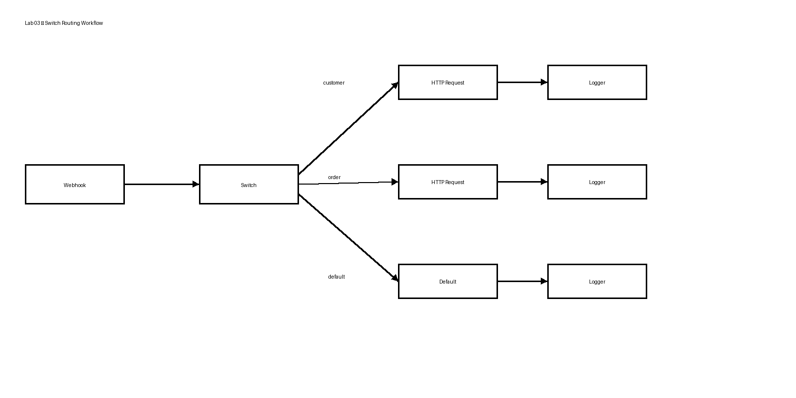

# Lab 03 – Route a Workflow using Switch

## Overview

In this lab, you will build a Workflow in IBM webMethods Integration that uses a **Switch** to route a request based on the value received in the input.

The Switch evaluates the incoming request type and directs the Workflow to the appropriate path.

## What You Will Build

The Workflow uses a Webhook to receive the request and a Switch to route the request.

### Workflow Diagram



[Open workflow diagram](screenshots/switch-routing-workflow.png)

```text
                         ┌── customer → HTTP Request → Logger
                         │
Webhook → Switch ────────┼── order → HTTP Request → Logger
                         │
                         └── default → Logger
```

### Routing Rules

| Input `type` | Route | Logger message |
|---|---|---|
| `customer` | Customer path | `Customer request received` |
| `order` | Order path | `Order request received` |
| Any other value | Default path | `Unknown request type` |

## Project and Workflow Details

| Item | Value |
|---|---|
| Platform | IBM webMethods Integration |
| Project | `WebMethodsIntegrationLabs` |
| Workflow | `Switch_Routing` |
| Trigger | Webhook |
| Routing | Switch |
| Cases | `customer`, `order` |
| Default | Unknown request type |

## Prerequisites

Before starting this lab, make sure you have:

- Access to **IBM webMethods Integration**
- Access to the `WebMethodsIntegrationLabs` project
- Permission to create and edit Workflows
- Basic familiarity with creating and running a webMethods Workflow
- Familiarity with the Webhook trigger

### Screenshot

[View workflow diagram](screenshots/switch-routing-workflow.png)

# Step 1 – Open the Project

Log in to **IBM webMethods Integration**.

Open:

```text
WebMethodsIntegrationLabs
```

Open **Workflows**.

# Step 2 – Create the Workflow

Click **+** to create a new Workflow.

Select **Create New Workflow**.

Enter:

```text
Switch_Routing
```

Click **Confirm**.

# Step 3 – Define the Webhook Trigger

Click **Define Trigger** and select **Webhook**.

The Webhook provides the input that the Switch will evaluate.

# Step 4 – Configure the Webhook

Configure the Webhook so that the request contains a `type` field.

For example:

```json
{
  "type": "customer"
}
```

The field used by the Switch is:

```text
type
```

Complete the Webhook configuration.

# Step 5 – Add the Switch

Add a **Switch** to the Workflow and connect the Webhook to it.

```text
Webhook → Switch
```

The Switch evaluates the incoming `type` value.

# Step 6 – Configure Case 1 – Customer

Configure Case 1 to evaluate:

```text
$request.type matches customer
```

For this case, configure the customer processing path.

The customer path includes an HTTP Request followed by a Logger.

Logger message:

```text
Customer request received
```

# Step 7 – Configure Case 2 – Order

Configure Case 2 to evaluate:

```text
$request.type matches order
```

For this case, configure the order processing path.

The order path includes an HTTP Request followed by a Logger.

Logger message:

```text
Order request received
```

# Step 8 – Configure the Default Path

Configure the Switch default path for values that do not match the defined cases.

Add a Logger with:

```text
Unknown request type
```

# Step 9 – Review the Complete Workflow


[Open the completed workflow image](screenshots/switch-routing-workflow.png)

The completed Workflow should contain:

```text
                         ┌── customer → HTTP Request → Logger
                         │
Webhook → Switch ────────┼── order → HTTP Request → Logger
                         │
                         └── default → Logger
```

Verify that:

- The Webhook is connected to the Switch.
- The Switch evaluates `$request.type`.
- Case 1 matches `customer`.
- Case 2 matches `order`.
- The default path handles other values.
- Each route is connected to its required actions.

# Step 10 – Test the Customer Route

Use:

```json
{
  "type": "customer"
}
```

Run the Workflow.

The Workflow should follow the Customer route.

Expected Logger message:

```text
Customer request received
```

# Step 11 – Test the Order Route

Use:

```json
{
  "type": "order"
}
```

Run the Workflow again.

The Workflow should follow the Order route.

Expected Logger message:

```text
Order request received
```

# Step 12 – Test the Default Route

Use a value that does not match either case:

```json
{
  "type": "product"
}
```

Run the Workflow.

The Workflow should follow the default route.

Expected Logger message:

```text
Unknown request type
```

# Step 13 – Review Execution History

Open **View Execution History** and select the latest execution.

Review the executed actions and Logger output.

For example, with:

```json
{
  "type": "customer"
}
```

the execution should follow the Customer route.

# Expected Result

| Test input | Expected route | Expected result |
|---|---|---|
| `customer` | Customer | `Customer request received` |
| `order` | Order | `Order request received` |
| `product` | Default | `Unknown request type` |

# Troubleshooting

## The Workflow reaches the default route unexpectedly

Check:

1. The Webhook payload contains the `type` field.
2. The Switch is evaluating `$request.type`.
3. The case value is entered exactly as configured.
4. The input value matches the case value.

For example:

```json
{
  "type": "customer"
}
```

must match:

```text
customer
```

# What You Learned

In this lab, you learned how to:

- Create a Workflow using a Webhook trigger
- Add a Switch to a Workflow
- Evaluate a value from Workflow input
- Configure multiple Switch cases
- Configure a default route
- Route requests based on input data
- Add actions to individual routes
- Use Logger actions to verify routing
- Test multiple routing scenarios
- Review Workflow execution history

# Lab Complete

You have successfully built a webMethods Workflow that uses a Switch to route requests to different processing paths based on the input value.

The key pattern is:

```text
Input → Switch → Select the appropriate processing path
```
