# Lab 04: Loop + Database Insert

**Hands-on Workflow Lab**

In this lab, you will build a webMethods Integration workflow that:

1. Receives a list of customers through a **Webhook**.
2. Uses an **Each Item Loop** to process the customer list one record at a time.
3. Inserts each customer into a PostgreSQL database using a **Database** action.
4. Queries the database after the loop to verify the inserted records.

> **Important:** In the final design, `Insert_Customer` is **inside the Loop**.  
> `Select_Customers` is **outside the Loop** and is used only to verify the records after the loop finishes.

---

## 1. What You Will Build

### Final workflow

```text
Webhook
   ↓
Loop
   │
   └── Insert_Customer
   ↓
Select_Customers
   ↓
Stop
```

Inside the Loop:

```text
Loop Start
   ↓
Insert_Customer
   ↓
Loop End
```

The workflow receives three customers:

```json
{
  "customers": [
    {
      "customerId": 101,
      "name": "John",
      "city": "Bangalore"
    },
    {
      "customerId": 102,
      "name": "Sara",
      "city": "Mumbai"
    },
    {
      "customerId": 103,
      "name": "Ahmed",
      "city": "Delhi"
    }
  ]
}
```

The Loop processes the records individually:

```text
Iteration 1 → John  → Database Insert
Iteration 2 → Sara  → Database Insert
Iteration 3 → Ahmed → Database Insert
```

After the loop completes, `Select_Customers` queries the database so that you can verify the result.

---

## 2. Lab Information

| Item | Value |
|---|---|
| Project | `WebMethodsIntegrationLabs` |
| Workflow | `Loop_Database_Insert` |
| Trigger | Webhook |
| Loop type | Each Item |
| Database | PostgreSQL |
| Cloud database used in this lab | Neon |
| Table | `customers` |
| Insert action | `Insert_Customer` |
| Verification action | `Select_Customers` |

---

## 3. Prerequisites

You need:

- Access to **IBM webMethods Integration**
- Permission to create/edit workflows
- The `WebMethodsIntegrationLabs` project
- A PostgreSQL database
- A database connection/account configured in webMethods Integration
- A table named `customers`

This lab uses **Neon PostgreSQL** as the cloud database.

### Security note

Do **not** publish your database password, connection secrets, API keys, or other credentials in GitHub screenshots or README files.

The screenshots in this tutorial use masked credentials where applicable.

---

# Part 1 — Prepare the PostgreSQL Database

## 4. Create the `customers` Table

In your PostgreSQL database, create the following table:

```sql
CREATE TABLE customers (
    customer_id INTEGER,
    name VARCHAR(100),
    city VARCHAR(100)
);
```

The table contains:

| Column | Type |
|---|---|
| `customer_id` | INTEGER |
| `name` | VARCHAR(100) |
| `city` | VARCHAR(100) |

For this lab, the table starts empty.

> **Important:** If you have already run the workflow while testing, clear the table before the final run:
>
> ```sql
> DELETE FROM customers;
> ```
>
> This prevents previous test runs from creating duplicate rows.

---

# Part 2 — Configure the Webhook

## 5. Create the Workflow

Open your `WebMethodsIntegrationLabs` project.

Create a new workflow:

```text
Loop_Database_Insert
```

The workflow should initially contain the standard trigger/start and Stop nodes.

---

## 6. Configure the Webhook Trigger

The Webhook provides the customer collection that will be processed by the Loop.

1. Open the workflow.
2. Select **Define Trigger**.
3. Select **Webhook**.
4. Configure the webhook request body using the following JSON:

```json
{
  "customers": [
    {
      "customerId": 101,
      "name": "John",
      "city": "Bangalore"
    },
    {
      "customerId": 102,
      "name": "Sara",
      "city": "Mumbai"
    },
    {
      "customerId": 103,
      "name": "Ahmed",
      "city": "Delhi"
    }
  ]
}
```

5. Continue through the Webhook configuration.
6. Save/complete the trigger configuration.

### Why this structure?

The important part is the `customers` array:

```text
customers
   ├── customer 101
   ├── customer 102
   └── customer 103
```

The Loop will process this array one item at a time.

---

# Part 3 — Configure the Loop

## 7. Add the Loop

Add a **Loop** action to the workflow.

Connect it after the Webhook.

Open the Loop configuration.

### Configure:

**Loop Type**

```text
Each Item
```

**Each Item In**

```text
$request → customers
```

The Loop configuration should look conceptually like:

```text
$request
   └── body
       └── customers
             ↓
          Each Item
```

**Screenshot:**

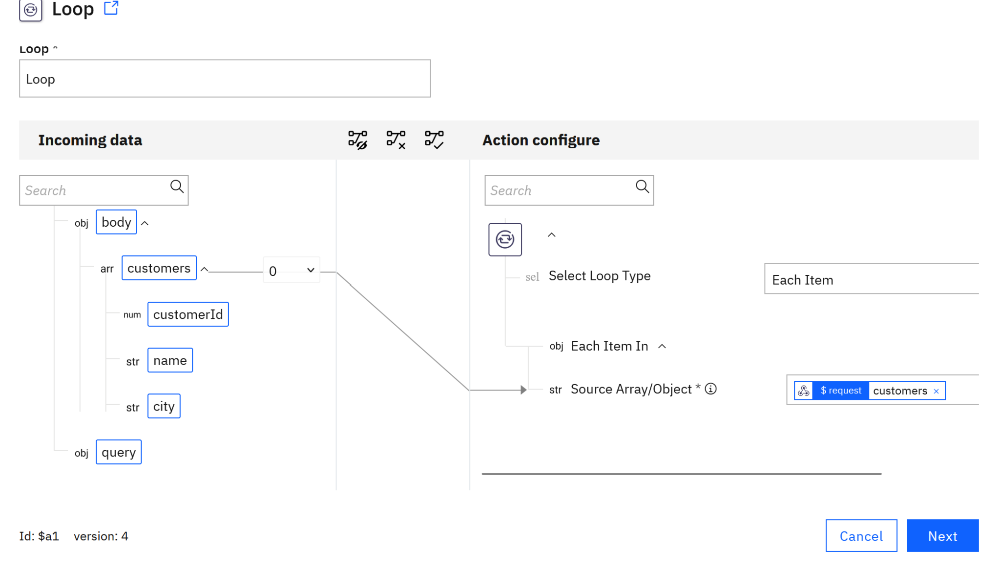

### What this means

The Loop receives the `customers` array and executes the actions inside the Loop once for every customer.

For our input:

```text
3 customers = 3 Loop iterations
```

---

## 8. Open the Loop Canvas

Double-click the **Loop** action.

You will enter the Loop's internal canvas.

Initially, the Loop contains its start and end points.

Add a **Database** action between the Loop Start and Loop End.

For this lab, the database action will be named:

```text
Insert_Customer
```

**Screenshot:**

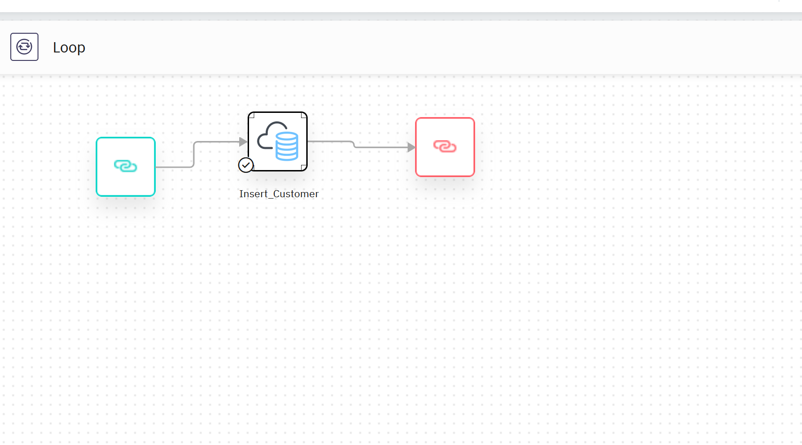

> **Very important:** `Insert_Customer` must be inside this Loop canvas.  
> If it is placed after the Loop on the main workflow canvas, it will not execute once per customer.

---

# Part 4 — Configure the PostgreSQL Database Account

## 9. Create the Database Account

If you have not already created a PostgreSQL account:

1. Open the Database connector.
2. Select **Add account**.
3. Configure the database as:

```text
Database:
PostgreSQL
```

```text
Driver group:
PostgreSQL JDBC Driver
```

```text
Transaction type:
NO_TRANSACTION
```

```text
DataSource class:
org.postgresql.ds.PGSimpleDataSource
```

For the server, user, password, database name, and port, use the values provided by your PostgreSQL/Neon connection details.

For the Neon database used in this lab:

```text
Database name: neondb
Port: 5432
User: neondb_owner
```

Use your own Neon server/host and password.

**Screenshot:**

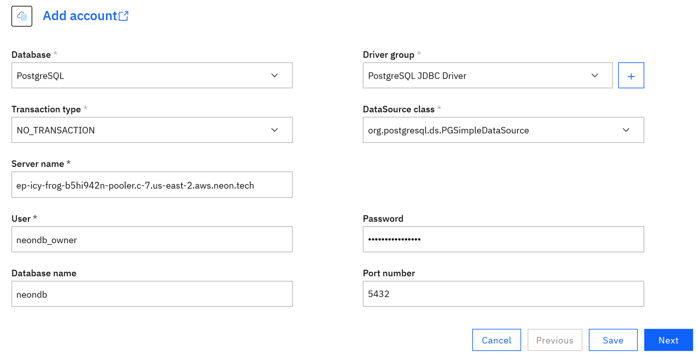

---

## 10. Advanced Database Settings

Open **Advanced configuration**.

For this lab, the additional settings can remain at their defaults unless your environment requires otherwise.

The captured lab configuration shows the default advanced area and a `loginTimeout` property.

**Screenshot:**

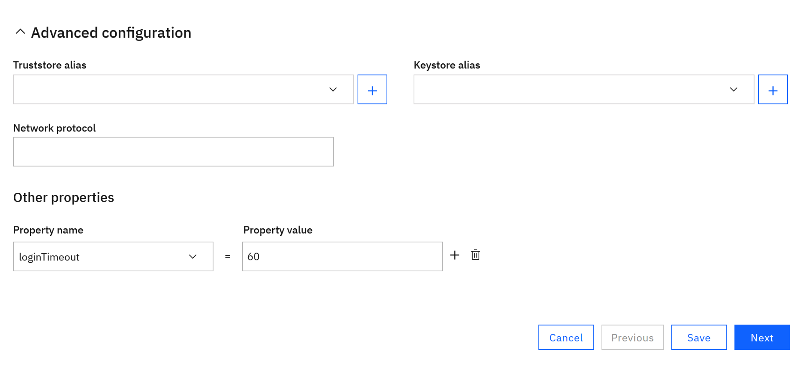

Complete the account configuration and save the account.

---

# Part 5 — Create the `Insert_Customer` Database Action

## 11. Add the Database Action

Inside the Loop canvas:

1. Add/select the **Database** connector.
2. Select **Create custom action** using the `+` option if required.
3. Give the action the name:

```text
Insert_Customer
```

4. Select the PostgreSQL account:

```text
Neon_PostgreSQL
```

5. Select the **Insert** action.

**Screenshot:**

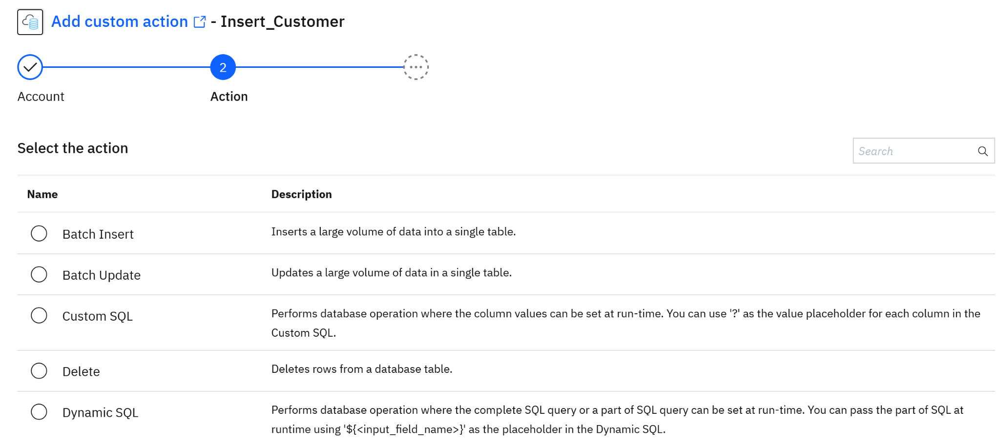

---

## 12. Select the `customers` Table

Select the database/table information.

Choose:

```text
Database: neondb
Schema: public
Table: customers
```

**Screenshot:**

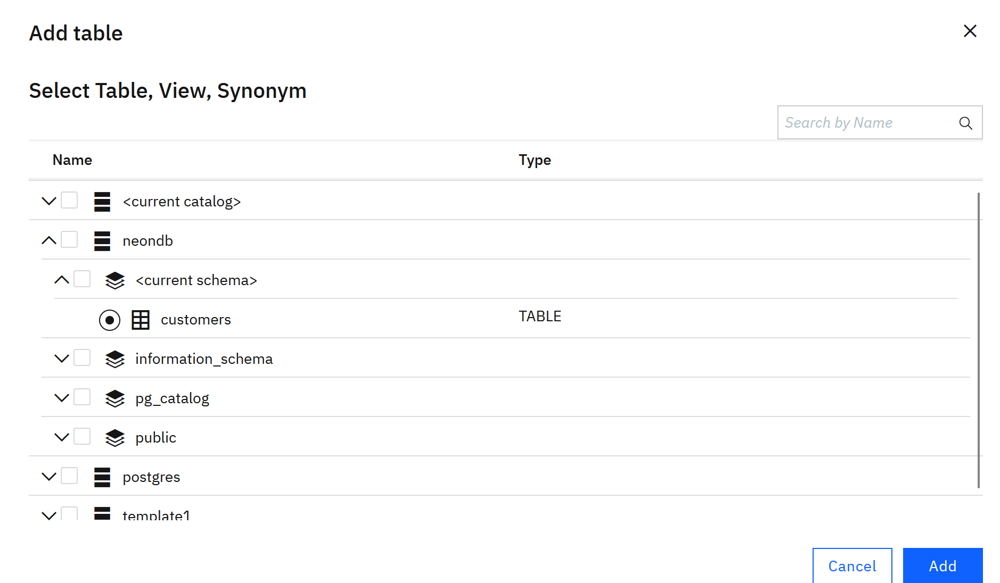

Select the three columns:

```text
customer_id
name
city
```

The Insert action should represent the equivalent SQL:

```sql
INSERT INTO customers
(customer_id, name, city)
VALUES (?, ?, ?);
```

---

# Part 6 — Map the Loop Data to the Database

## 13. Configure the Input Mapping

When the Database action opens the mapping screen, the Loop exposes values such as:

```text
currentIndex
currentItem
currentKey
currentValue
totalLength
```

For this lab, use the fields inside:

```text
currentValue
```

Expand `currentValue`.

You should see:

```text
customerId
name
city
```

Map them as follows:

| Loop value | Database field |
|---|---|
| `currentValue.customerId` | `customer_id` |
| `currentValue.name` | `name` |
| `currentValue.city` | `city` |

**Screenshot:**

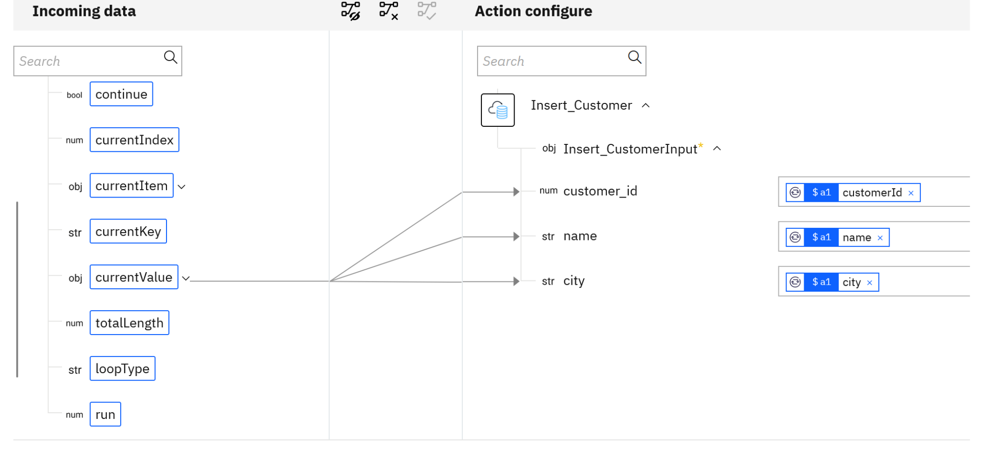

After mapping, the completed configuration should show the three values connected to the Database action.

**Screenshot:**

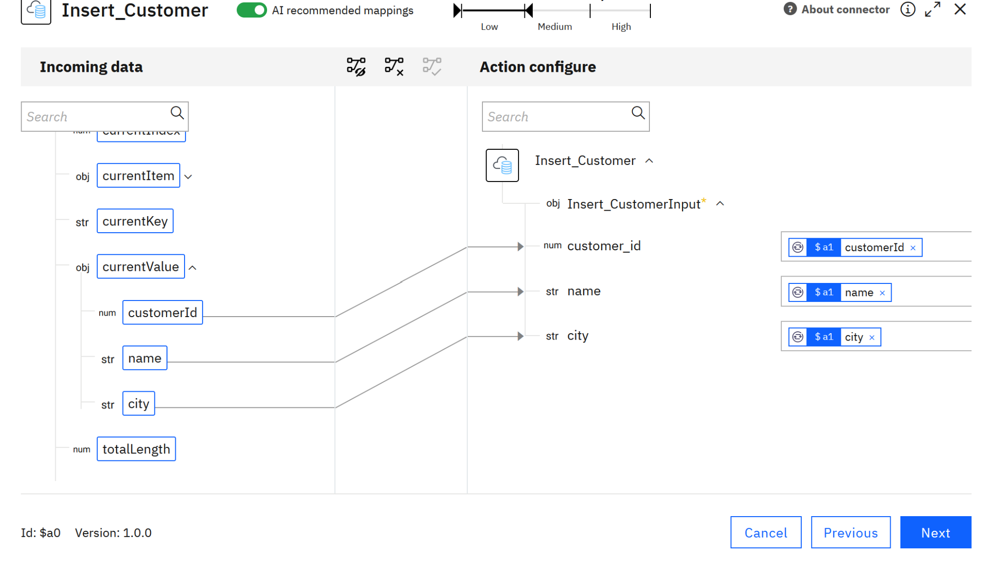

### Why `currentValue`?

`currentValue` represents the customer currently being processed by the Loop.

For example, during Iteration 1:

```json
{
  "customerId": 101,
  "name": "John",
  "city": "Bangalore"
}
```

During Iteration 2, `currentValue` changes to Sara.

During Iteration 3, it changes to Ahmed.

That is what allows the same Database action to process every customer.

---

# Part 7 — Test the Insert Action

## 14. Test `Insert_Customer`

Continue to the action test screen.

The test should use a sample customer such as:

```text
customer_id: 101
name: John
city: Bangalore
```

Run the test.

A successful result should show the input values being processed.

**Screenshot:**

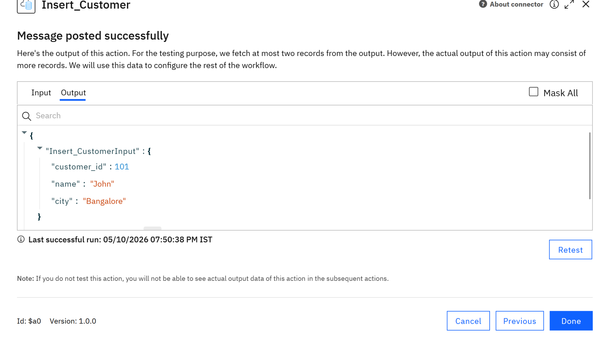

Once the test succeeds, select **Done**.

---

# Part 8 — Configure the Database Verification Action

## 15. Return to the Main Workflow Canvas

Close the Loop canvas and return to the main workflow.

The final main workflow should contain:

```text
Webhook
   ↓
Loop
   ↓
Select_Customers
   ↓
Stop
```

`Insert_Customer` remains inside the Loop.

---

## 16. Add `Select_Customers`

Add another **Database** action after the Loop.

Create a custom action named:

```text
Select_Customers
```

Use the same database account:

```text
Neon_PostgreSQL
```

Select:

```text
Action: Select
Table: customers
```

Configure the data fields:

```text
customer_id
name
city
```

**Screenshot:**

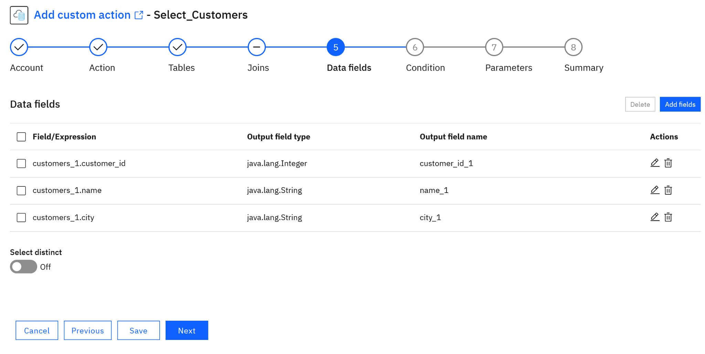

---

## 17. Configure Select Parameters

For this lab, leave the execution parameters at their defaults.

The important point is that the action queries the `customers` table after the Loop has finished.

**Screenshot:**

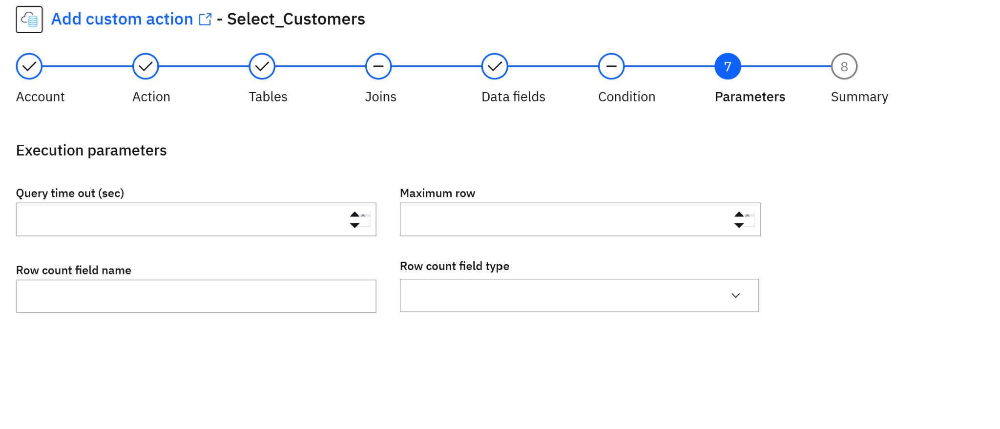

---

## 18. Review the Select Action

Review the summary.

You should see:

```text
Name:
Select_Customers

Account:
Neon_PostgreSQL

Action:
Select
```

The generated SQL should select:

```text
customer_id
name
city
```

from the `customers` table.

**Screenshot:**

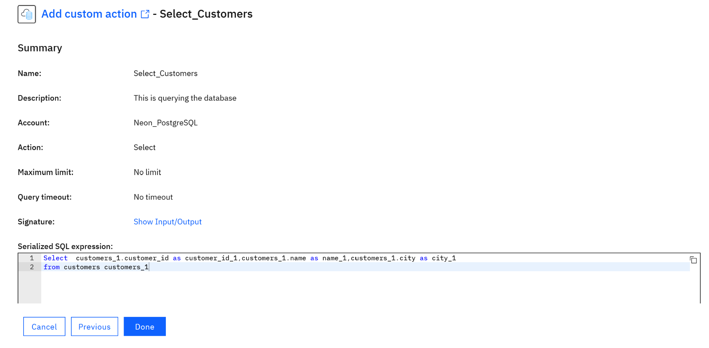

Select **Done**.

---

# Part 9 — Test the Select Action

## 19. Test `Select_Customers`

Open the test screen and select **Test**.

The action should return records from the `customers` table.

**Screenshot:**

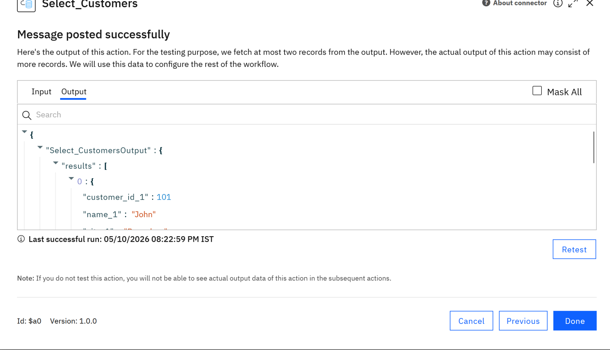

> **Note:** If you have already executed the workflow multiple times, you may see duplicate customers in this output. This is expected if the table was not cleared between test runs.

For the final clean run, clear the table first and run the workflow once.

---

# Part 10 — Verify the Final Workflow

## 20. Confirm the Main Workflow

Your final main workflow should look like:

```text
┌─────────┐
│ Webhook │
└────┬────┘
     ↓
┌─────────┐
│  Loop   │
└────┬────┘
     │
     │  Inside Loop:
     │  ┌─────────────────┐
     └─→│ Insert_Customer │
        └─────────────────┘
     ↓
┌─────────────────┐
│ Select_Customers│
└────┬────────────┘
     ↓
┌──────┐
│ Stop │
└──────┘
```

**Screenshot:**

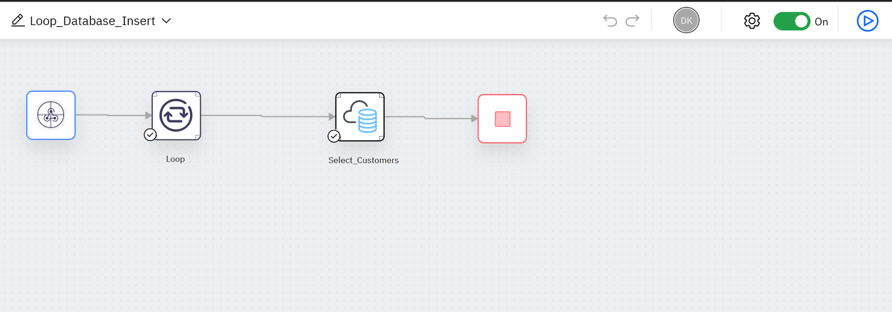

### Why is `Select_Customers` outside the Loop?

Because we do not want to query the database three times.

The purpose of the design is:

```text
Loop → insert every customer
        ↓
Loop finishes
        ↓
Select_Customers → verify the final database contents
```

This keeps the verification step separate from the processing loop.

---

# Part 11 — Run the Complete Workflow

## 21. Clear Previous Test Data

Before the final run, make sure the `customers` table is empty.

Run:

```sql
DELETE FROM customers;
```

Then verify that there are no old rows.

---

## 22. Run the Workflow

Run:

```text
Loop_Database_Insert
```

using the three-customer webhook payload from Section 6.

The Loop should execute three iterations.

Expected execution:

```text
Iteration 1 → Insert_Customer
Iteration 2 → Insert_Customer
Iteration 3 → Insert_Customer
```

---

## 23. Review Execution History

Open the latest execution.

Expand the Loop.

You should see:

```text
Iteration 1
    Insert_Customer → executed

Iteration 2
    Insert_Customer → executed

Iteration 3
    Insert_Customer → executed
```

**Screenshot:**

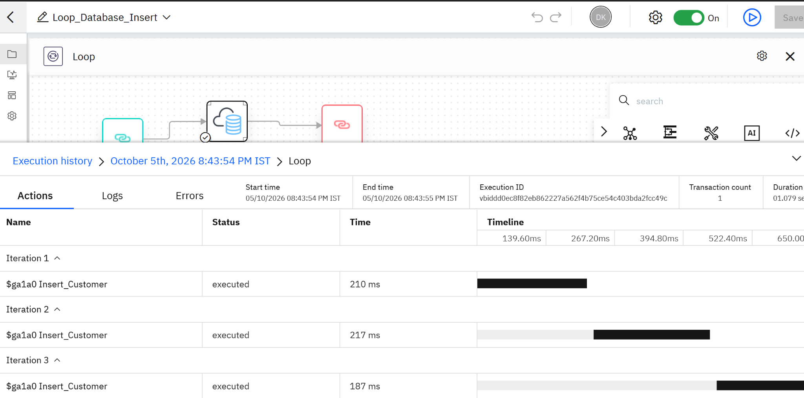

This is the key proof that the Database Insert action is running **inside the Loop**.

---

# Part 12 — Verify the Database Output

## 24. Review `Select_Customers` Output

Select the `Select_Customers` action in Execution History.

Its output should contain the records returned from the database.

A clean run should return:

```text
101 | John  | Bangalore
102 | Sara  | Mumbai
103 | Ahmed | Delhi
```

**Screenshot:**

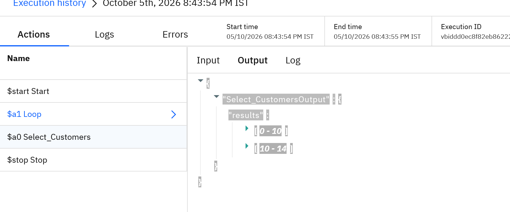

---

## 25. Verify the Neon Table

Open the `customers` table in Neon.

For a clean final run, you should see exactly three rows:

| customer_id | name | city |
|---:|---|---|
| 101 | John | Bangalore |
| 102 | Sara | Mumbai |
| 103 | Ahmed | Delhi |

**Screenshot:**

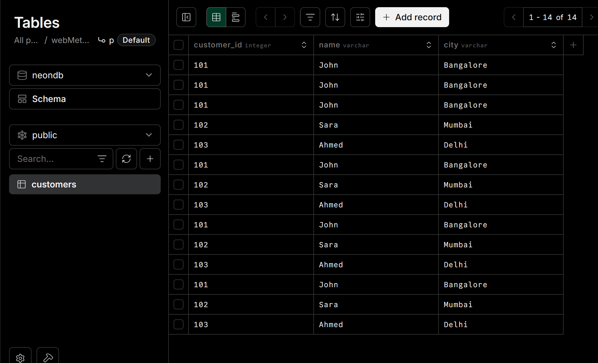

---

# 26. Troubleshooting

### Problem: Only one customer is inserted

Check that:

```text
Insert_Customer
```

is **inside the Loop canvas**, not after the Loop on the main workflow.

The Loop execution history should show multiple iterations.

---

### Problem: Duplicate rows appear

The workflow inserts records each time it runs.

Clear the test data before another clean run:

```sql
DELETE FROM customers;
```

Then run the workflow once.

---

### Problem: `currentValue` does not show customer fields

Make sure the Loop is configured as:

```text
Each Item
```

and the source is:

```text
$request → customers
```

Then expand:

```text
currentValue
```

You should see:

```text
customerId
name
city
```

---

### Problem: `Select_Customers` shows more records than expected

This usually means the database contains records from previous test executions.

Remember:

```text
Every workflow run
       ↓
Every Loop iteration
       ↓
Inserts another database row
```

Clear the table and run once for a clean result.

---

# 27. What You Learned

By completing this lab, you learned how to:

- Configure a PostgreSQL database account in webMethods Integration.
- Configure a Webhook with an array of objects.
- Configure an **Each Item Loop**.
- Use `currentValue` inside a Loop.
- Create a Database custom action.
- Insert data into PostgreSQL.
- Map Loop data to database fields.
- Place an action **inside** a Loop.
- Query the database after the Loop.
- Use Execution History to verify multiple Loop iterations.
- Verify the final records directly in the database.

---

# 28. Integration Pattern

This lab demonstrates a common integration pattern:

```text
Receive Collection
       ↓
Process Each Item
       ↓
Persist Item
       ↓
Verify Result
```

In a real enterprise integration, the same pattern could be used for:

- Customer synchronization
- Order processing
- Product updates
- Employee data loads
- Batch API processing
- File-to-database integration
- Application-to-database synchronization

---

# 29. Final Checklist

Before marking the lab complete, confirm:

- [ ] Workflow is named `Loop_Database_Insert`
- [ ] Webhook is configured
- [ ] `customers` array is available
- [ ] Loop type is `Each Item`
- [ ] Loop source is `$request → customers`
- [ ] `Insert_Customer` is inside the Loop
- [ ] `currentValue.customerId` maps to `customer_id`
- [ ] `currentValue.name` maps to `name`
- [ ] `currentValue.city` maps to `city`
- [ ] `Select_Customers` is outside the Loop
- [ ] Workflow runs successfully
- [ ] Execution History shows 3 Loop iterations
- [ ] Neon contains the expected customer records

---

## Lab Complete

You have now built a webMethods Integration workflow that receives a collection of records, processes them one at a time using a Loop, persists each record into PostgreSQL, and verifies the result.

**Learn → Build → Integrate → Automate**
