# Lab 01 – Basic Flow Service

Build your first **webMethods Flow Service** using a simple customer greeting example.

This lab introduces the fundamentals of a Flow Service:

- Creating a Flow Service in the existing `WebMethodsIntegrationLabs` project
- Defining input and output fields
- Opening the Transform Pipeline
- Mapping an input field to an output field
- Using a pipeline variable in a text value
- Testing the Flow Service
- Reading the execution result

> **Important:** All labs in this repository use the same `WebMethodsIntegrationLabs` project. You do not need to create a new project for every lab.

---

## What You Will Build

The Flow Service accepts a customer name and returns a personalized greeting.

```text
Input
  name = John
    |
    v
Transform Pipeline
    |
    +---- name  --------------------> name
    |
    +---- "Hello %name%" ----------> message
                                      |
                                      v
                                    Output
```

### Example

**Input**

```text
name = John
```

**Output**

```text
name    = John
message = Hello John
```

---

## Lab Information

| Item | Value |
|---|---|
| Product | IBM webMethods Integration |
| Project | `WebMethodsIntegrationLabs` |
| Flow Service | `Customer_Greeting` |
| Difficulty | Beginner |
| Concepts | Input, Output, Mapping, Pipeline Variable, Testing |

---

## Prerequisites

You need access to an IBM webMethods Integration environment with permission to create and run Flow Services.

No external application, database, API, or connector is required for this lab.

---

# Part 1 – Create or Open the Project

All tutorials in this repository use the same project:

```text
WebMethodsIntegrationLabs
```

If you already created this project while completing **Workflow Lab 01 – REST GET**, open the existing project and continue with Part 2.

If you are starting from scratch, follow these steps.

### Step 1 – Open Projects

From webMethods Integration, open the **Projects** area.

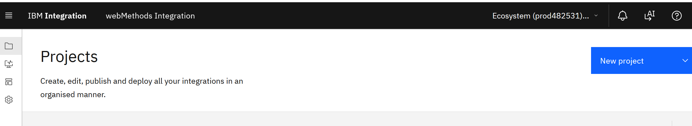

### Step 2 – Create the Project

Create a new project and enter:

```text
Project name: WebMethodsIntegrationLabs
```

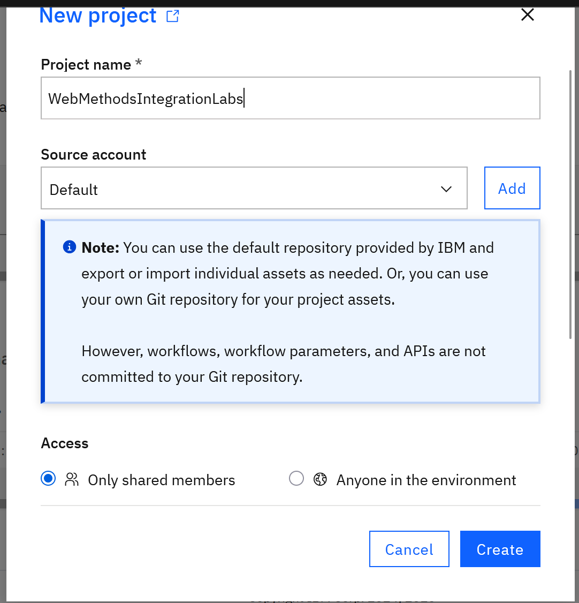

### Step 3 – Open the Project

After the project is created, open `WebMethodsIntegrationLabs`.

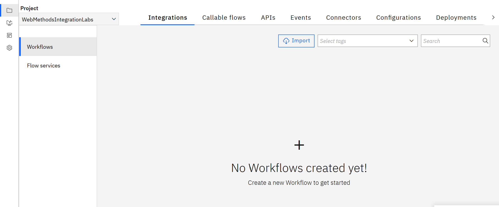

> If the project already exists, do **not** create another one. Reuse `WebMethodsIntegrationLabs` for this and the following labs.

---

# Part 2 – Create the Flow Service

### Step 4 – Open Flow Services

Inside `WebMethodsIntegrationLabs`:

1. Select **Flow services** Run in Cloud 
2. Select **Create** to create a new Flow Service.
3. When prompted to select the Flow Service type, choose **Flow Service**.

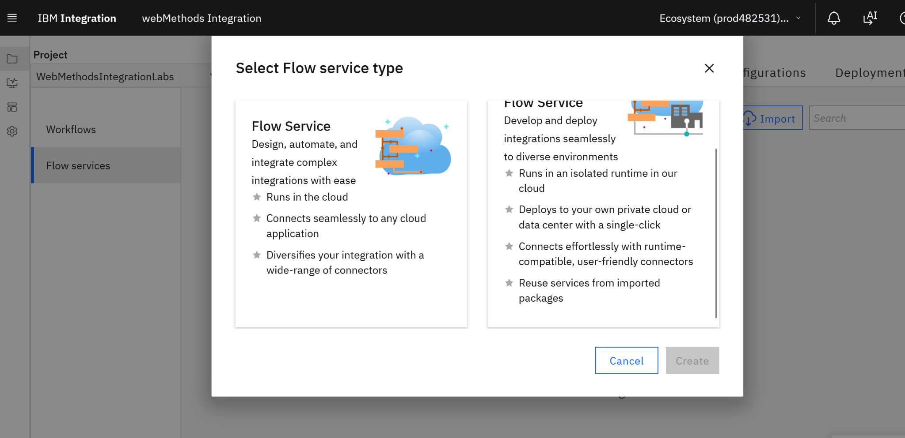

### Step 5 – Create the Flow Service

The Flow Service editor opens.

Enter the Flow Service name:

```text
Customer_Greeting
```

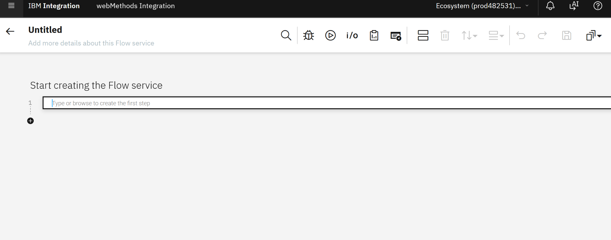

The Flow Service is now ready to configure.

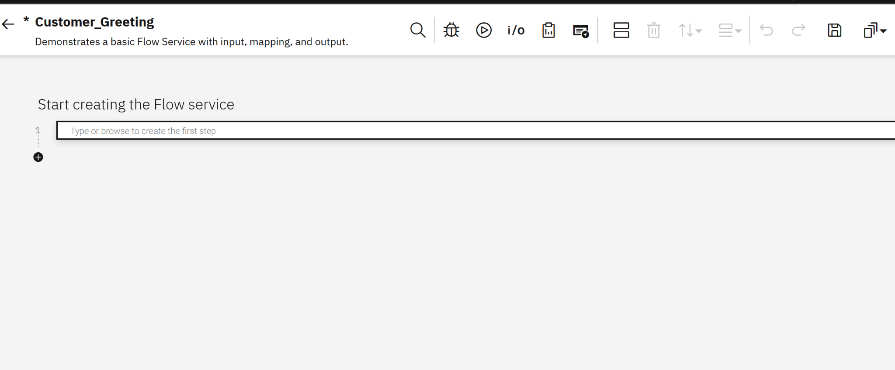

---

# Part 3 – Define the Input

Our Flow Service needs one input field:

```text
name
```

### Step 6 – Open Input and Output Fields

Open the **I/O** configuration for the Flow Service.

Select **Input Fields** and choose **Add a new set**.

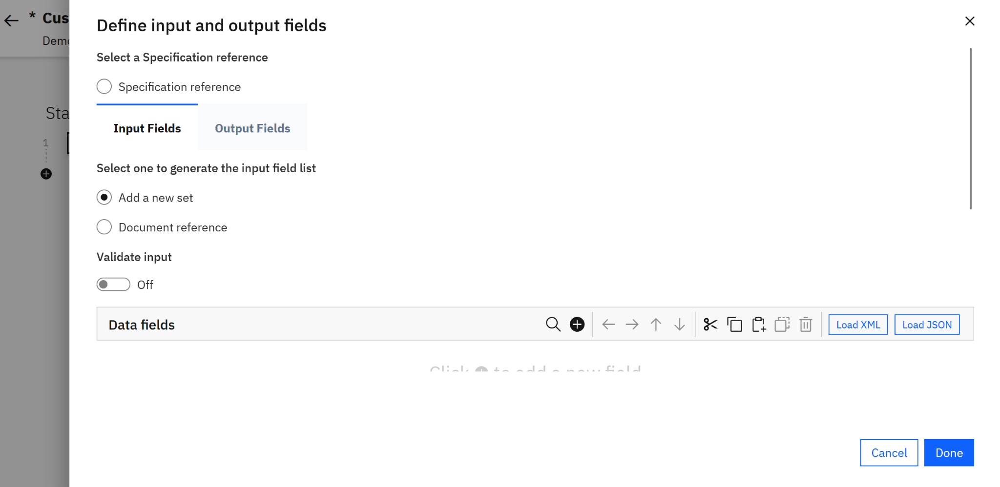

### Step 7 – Add the `name` Input Field

Add a field with the following values:

| Property | Value |
|---|---|
| Name | `name` |
| Type | `String` |
| Required | No |

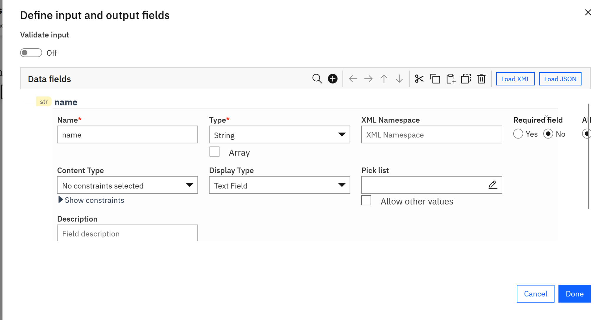

Complete the input definition and confirm that `name` appears under the input fields.

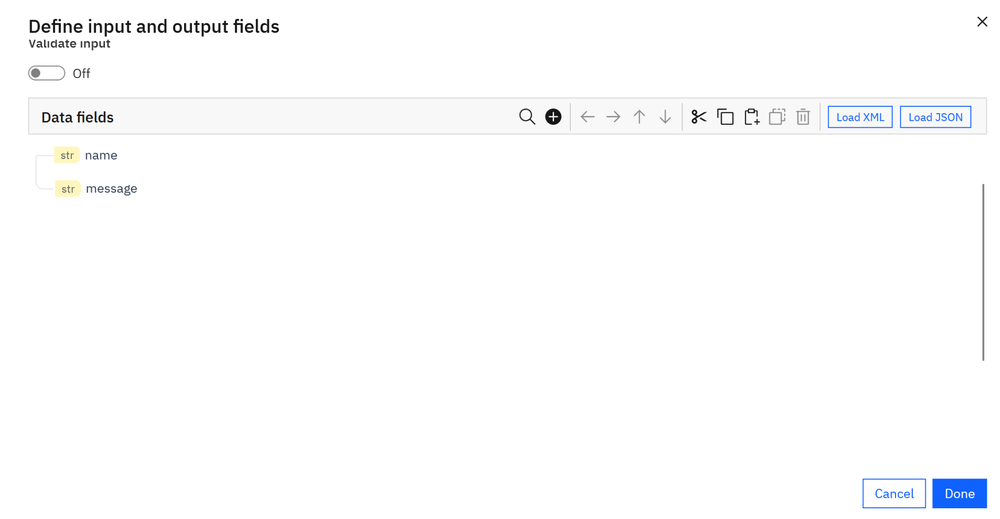

---

# Part 4 – Define the Output

The Flow Service will return two output fields:

```text
name
message
```

The `name` output will contain the original customer name.

The `message` output will contain the personalized greeting.

### Step 8 – Add the Output Fields

Open **Output Fields**.

Create the output structure with:

```text
name      String
message   String
```

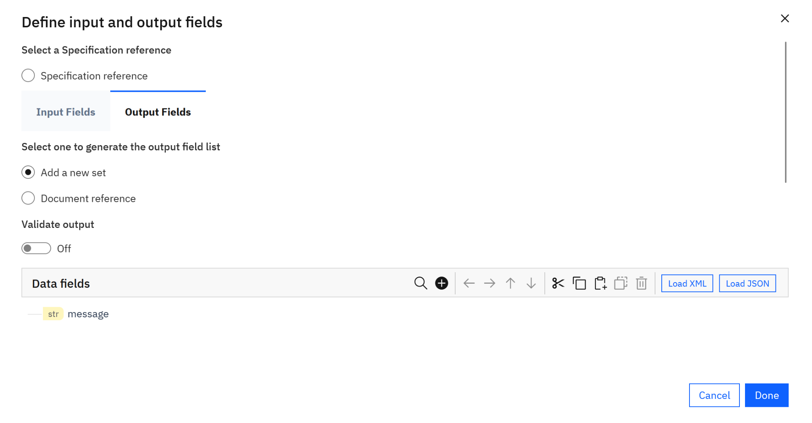

Select **Done** to return to the Flow Service editor.

---

# Part 5 – Add the Transform Pipeline

The Transform Pipeline is where we will map the input data to the output and construct the greeting message.

### Step 9 – Add Transform Pipeline

In the Flow Service editor, select the first-step field and search for:

```text
Transform Pipeline
```

Select it.

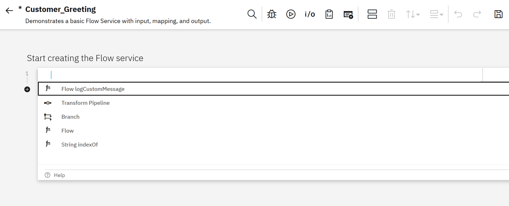

The Flow Service now contains the Transform Pipeline step.

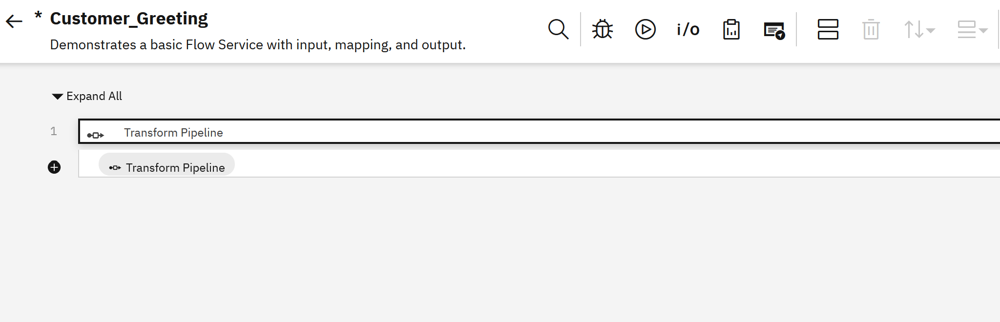

---

# Part 6 – Map `name` to `name`

Open the Transform Pipeline.

You should see:

```text
Pipeline Input                 Pipeline Output

name ------------------------> name

                                message
```

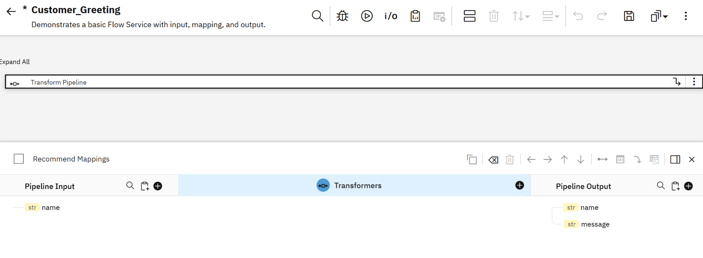

### Step 10 – Create the Direct Map

Map the input field:

```text
name
```

to the output field:

```text
name
```

This creates a direct mapping.

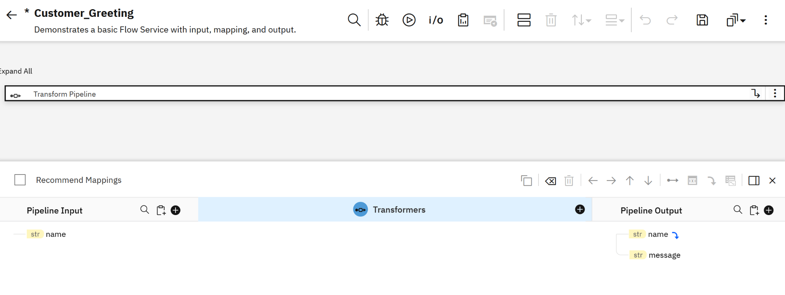

The completed mapping should show the input `name` connected to the output `name`.

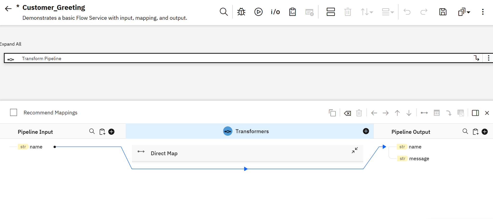

---

# Part 7 – Create the Greeting Message

Now we will populate the `message` output.

Instead of creating another input field, we will use a **pipeline variable substitution** in a text value.

The value will be:

```text
Hello %name%
```

The `%name%` notation tells the Flow Service to substitute the current pipeline value of `name`.

### Step 11 – Set the Message Value

Select the `message` output field and choose **Set value**.

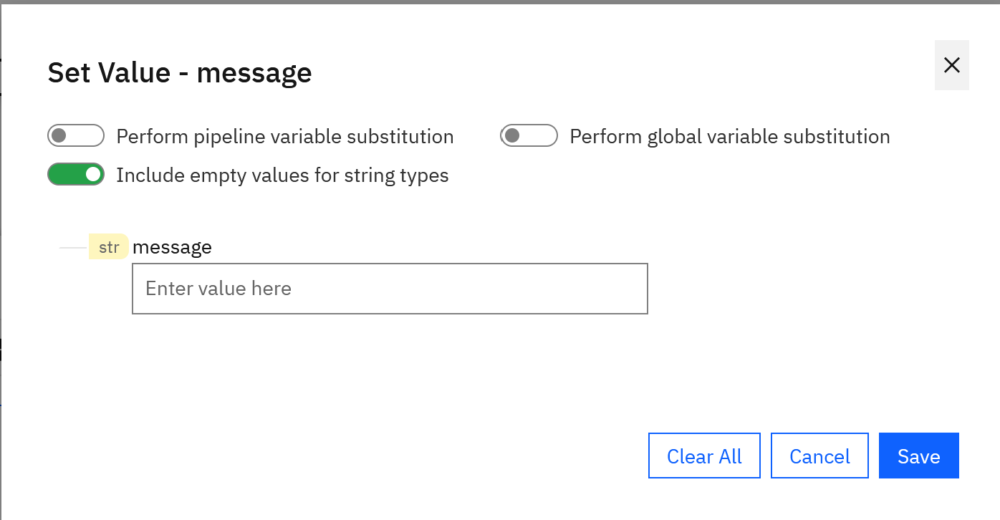

Turn on:

```text
Perform pipeline variable substitution
```

Then enter:

```text
Hello %name%
```

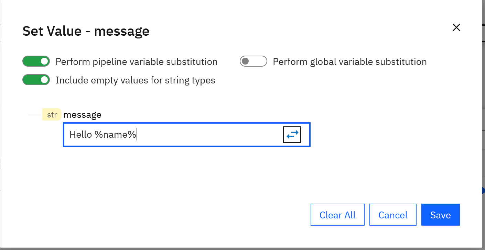

Save the value.

The completed pipeline mapping should now contain:

```text
name → name

Hello %name% → message
```

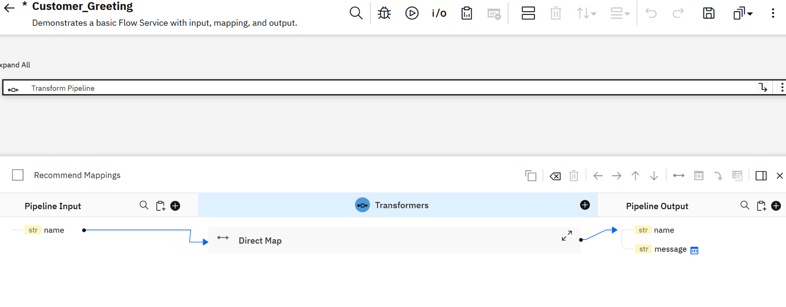

---

# Part 8 – Test the Flow Service

### Step 12 – Run the Flow Service

Use the **Run/Test** option in the Flow Service editor.

Enter the following test value:

```text
name = John
```

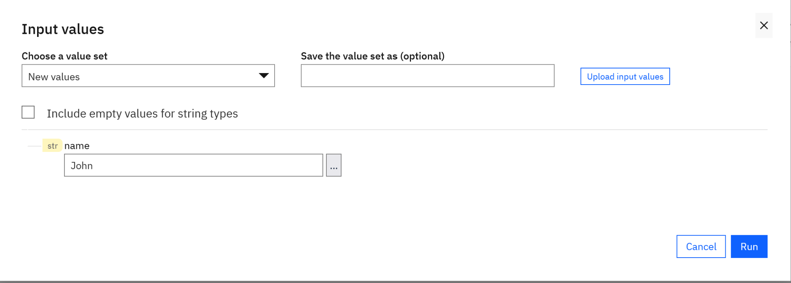

Run the Flow Service.

### Step 13 – Verify the Result

The execution should complete successfully.

Expected output:

```text
name    = John
message = Hello John
```

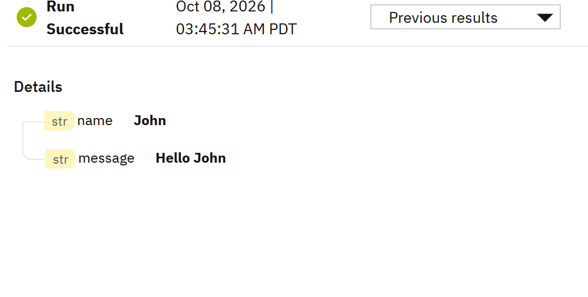

---

# Part 9 – Final Flow Service

The completed Flow Service contains a single **Transform Pipeline** step.

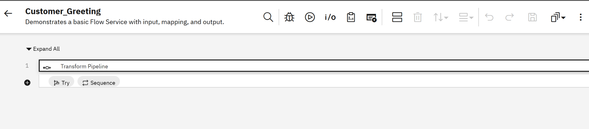

Conceptually:

```text
Customer_Greeting
       |
       v
Transform Pipeline
       |
       +---- name ----------------> name
       |
       +---- Hello %name% -------> message
```

---

# What You Learned

You have now created your first webMethods Flow Service and learned how to:

- Create a Flow Service inside an existing project
- Define input fields
- Define output fields
- Open and work with the Transform Pipeline
- Create a direct field mapping
- Set a constant/text value
- Use pipeline variable substitution
- Test a Flow Service
- Validate the execution output

---

# Why This Matters in Real Integrations

The example is intentionally simple, but the same Flow Service concepts are used in larger integrations.

A Flow Service can receive input data, transform it, map fields, enrich data, call other services or connectors, and produce a standardized output.

In later labs, these basic mapping concepts will be combined with REST APIs, databases, branching, looping, and eventually Workflow orchestration.

---

# Final Checklist

- [ ] `WebMethodsIntegrationLabs` project exists
- [ ] `Customer_Greeting` Flow Service created
- [ ] Input field `name` created
- [ ] Output fields `name` and `message` created
- [ ] Transform Pipeline added
- [ ] `name` mapped to `name`
- [ ] `message` configured as `Hello %name%`
- [ ] Pipeline variable substitution enabled
- [ ] Test executed with `John`
- [ ] Result returned `Hello John`

---

## Lab Complete

You have completed **Flow Services – Lab 01: Basic Flow Service**.

**Next:** Build a Flow Service that invokes and processes a REST API.
