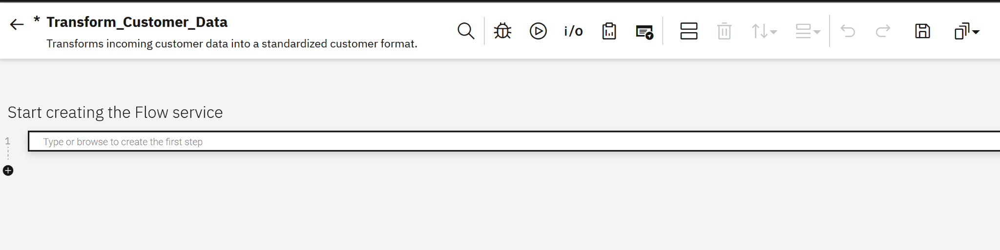
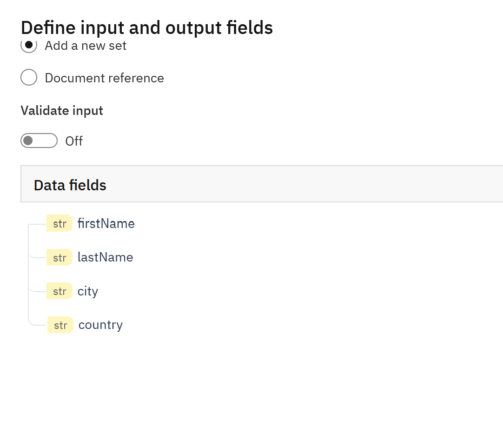
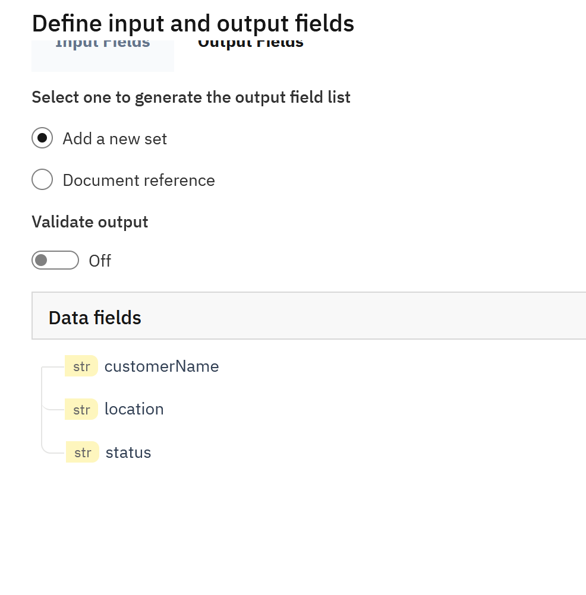
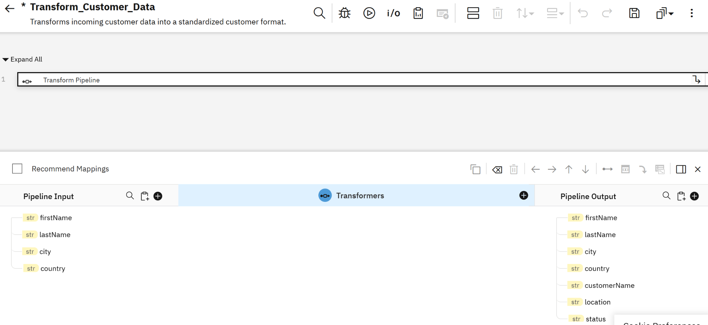
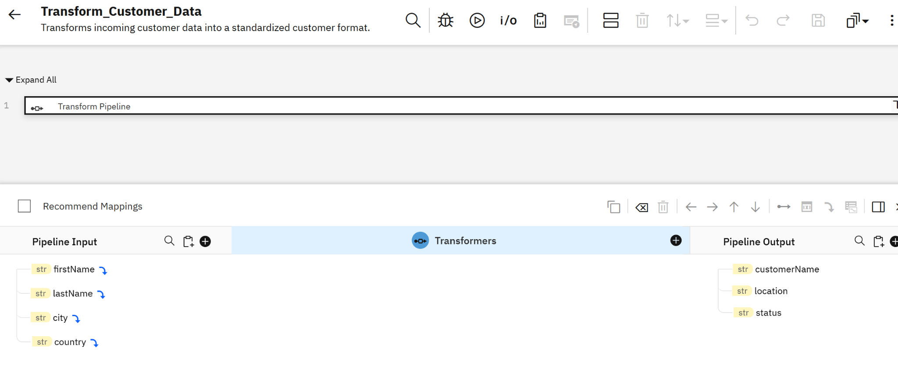
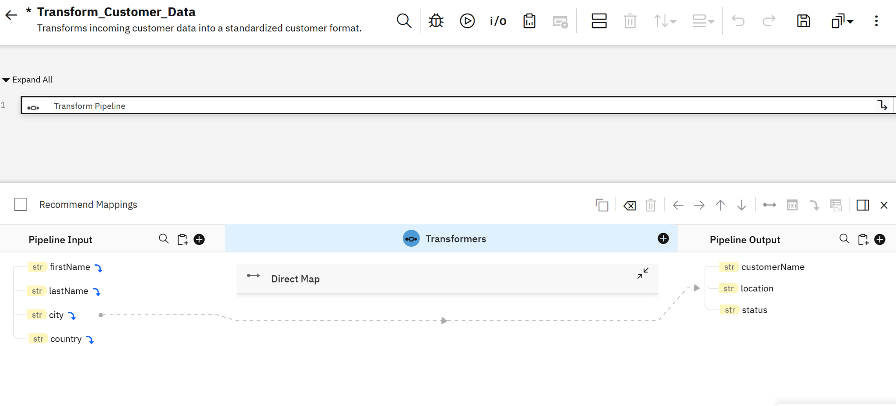
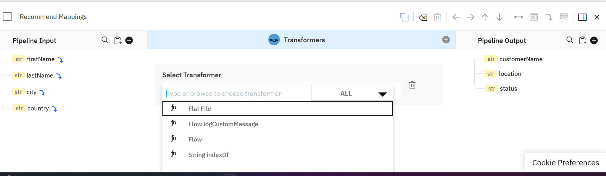
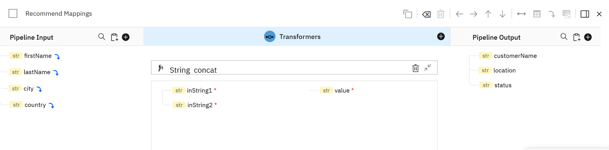
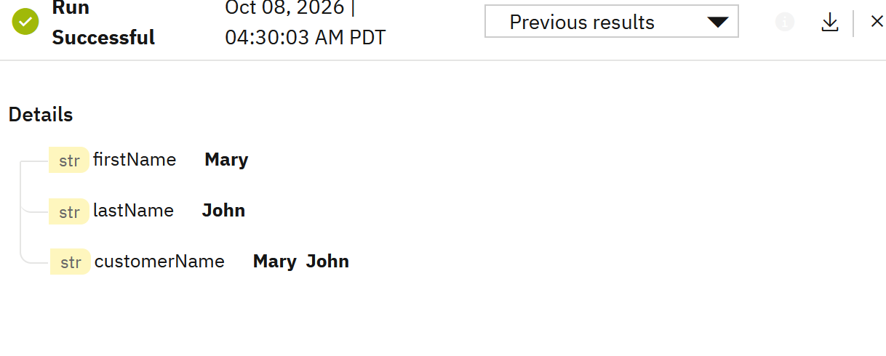
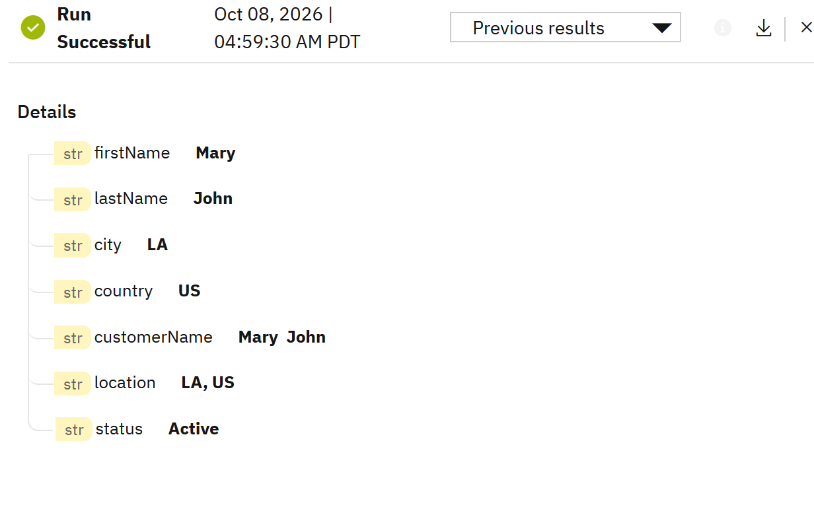

# Lab 02 – Transform Customer Data

This lab demonstrates how to use a **webMethods Flow Service** to transform incoming customer data into a standardized format.

The lab focuses on the **Transform Pipeline**, field mapping, the `String concat` transformer, and the concept of data being carried through the pipeline as additional values are created.

## What You Will Build

A Flow Service named:

`Transform_Customer_Data`

The service accepts customer information and creates standardized values:

```text
Input Customer Data
        ↓
Transform Pipeline
        ├── customerName = firstName + " " + lastName
        ├── location     = city + ", " + country
        └── status       = Active
        ↓
Transformed Pipeline Output
```

## Learning Objectives

By completing this lab, you will learn how to:

- Define Flow Service input and output fields
- Use a Transform Pipeline
- Understand how values are carried through the pipeline
- Combine two strings using the `String concat` transformer
- Create transformed fields from existing pipeline values
- Add a constant status value
- Test a Flow Service and inspect the runtime pipeline

## Prerequisites

- Access to IBM webMethods Integration / webMethods Integration SaaS
- Access to the webMethods Integration development environment
- The `WebMethodsIntegrationLabs` project

This lab uses the same project created in Workflow Lab 01. If you are starting independently, create the project first and open the Project Workspace.

## Lab Information

| Item | Value |
|---|---|
| Project | `WebMethodsIntegrationLabs` |
| Service | `Transform_Customer_Data` |
| Type | Flow Service |
| Main feature | Transform Pipeline |
| Transformer | String `concat` |

---

## Step 1 – Create the Flow Service

In the `WebMethodsIntegrationLabs` project:

1. Open **Flow Services**.
2. Select **Add** / **New Flow Service**.
3. Create the service:

```text
Transform_Customer_Data
```

4. Use this description:

```text
Transforms incoming customer data into a standardized customer format.
```

5. Open the Flow Service editor.

The completed service is shown below.



---

## Step 2 – Define the Input Fields

Click the **i/o** icon at the top of the Flow Service editor.

Under **Input Fields**, select **Add a new set**.

Leave **Validate input** turned **Off** for this lab.

Create the following fields:

| Field | Type | Required |
|---|---|---|
| `firstName` | String | No |
| `lastName` | String | No |
| `city` | String | No |
| `country` | String | No |



### Why validation is off

This lab is focused on transformation rather than validation or error handling. Required-field validation will be covered in a later error-handling lab.

---

## Step 3 – Define the Output Fields

Under **Output Fields**, select **Add a new set**.

Leave **Validate output** turned **Off**.

Create:

| Field | Type | Required |
|---|---|---|
| `customerName` | String | No |
| `location` | String | No |
| `status` | String | No |



Finish the Input/Output definition and return to the Flow Service editor.

---

## Step 4 – Add a Transform Pipeline

In the Flow Service editor, add the first step:

**Transform Pipeline**

The service now contains the transformation step.



Open the Transform Pipeline to work with the pipeline input, transformers, and pipeline output.

---

## Step 5 – Understand the Pipeline

Inside the Transform Pipeline, the input values are available as pipeline data.

For this lab, the initial input is:

```json
{
  "firstName": "Mary",
  "lastName": "John",
  "city": "LA",
  "country": "US"
}
```

As transformations are performed, new values can be added to the pipeline while the existing values remain available to subsequent steps.

This is an important Flow Service concept:

> **The pipeline carries data from one step to the next.**

For example, after creating `customerName`, the pipeline can contain both the original `firstName` and `lastName` values and the newly created `customerName` value.



---

## Step 6 – Create `customerName`

We want to transform:

```text
firstName + " " + lastName
```

into:

```text
customerName
```

### Add the String concat transformer

In the **Transformers** section, select **+**.

Search for:

```text
concat
```

Under the String functions, select **concat**.



The transformer appears as:

```text
String concat
```



The transformer provides:

- `inString1`
- `inString2`
- `value`



### Build the customer name

Use the concat transformation to construct the name with a space between the two values.

The transformation is conceptually:

```text
firstName + " " + lastName
```

The completed runtime result is:

```text
Mary John
```

The first successful test confirms that the transformed `customerName` is created correctly.



---

## Step 7 – Create `location`

Create the location value using the same transformation approach:

```text
city + ", " + country
```

For the test data:

```text
LA + ", " + US
```

produces:

```text
LA, US
```

The important point is that `city` and `country` are still available in the pipeline when the location transformation is performed.

---

## Step 8 – Create `status`

Create a constant status value:

```text
Active
```

This demonstrates that a pipeline output value does not always have to come directly from an input field. A transformation can also create a constant value.

> For the final lab screenshot, the runtime value shown is `Active`.

---

## Step 9 – Test the Flow Service

Run the Flow Service with this test data:

```json
{
  "firstName": "Mary",
  "lastName": "John",
  "city": "LA",
  "country": "US"
}
```

The successful run shows:

```text
firstName     = Mary
lastName      = John
city          = LA
country       = US
customerName  = Mary John
location      = LA, US
status        = Active
```



This result demonstrates the key lesson of the lab: **the pipeline retains the incoming values while the transformation adds new values that can be used by later steps.**

---

## Expected Result

For the test input:

```json
{
  "firstName": "Mary",
  "lastName": "John",
  "city": "LA",
  "country": "US"
}
```

the transformed values should include:

```json
{
  "customerName": "Mary John",
  "location": "LA, US",
  "status": "Active"
}
```

The original input fields may also remain visible in the pipeline because they continue to be available as pipeline data.

---

## What You Learned

### 1. Flow Service Input/Output

A Flow Service can explicitly define the data it accepts and the values it produces.

### 2. Transform Pipeline

The Transform Pipeline is used to map and transform data as it moves through a Flow Service.

### 3. Pipeline Data

Values are carried through the pipeline and can be reused by subsequent transformations.

### 4. String Transformation

The `String concat` transformer can combine string values to create a new value.

### 5. Derived Values

A Flow Service can create new values such as `customerName` and `location` from existing input data.

---

## Enterprise Relevance

The same pattern is commonly used when integrating systems that use different data formats or naming conventions.

For example:

```text
Source System
    ↓
firstName / lastName / city / country
    ↓
Flow Service Transform Pipeline
    ↓
Standardized Customer Data
    ↓
Target Application / API / Database
```

This is one of the core capabilities of webMethods Flow Services: **receive data, transform it, and make the transformed data available to the next integration step.**

---

## Lab Complete

You have now created a Flow Service that:

- Accepts customer information
- Carries the data through the pipeline
- Creates a combined customer name
- Creates a standardized location
- Adds a status value
- Successfully executes and displays the transformed data

### Next Flow Service Lab

**Lab 03 – Branching / Conditional Processing**

In the next lab, we will use Flow Service branching to make a decision based on incoming data.
